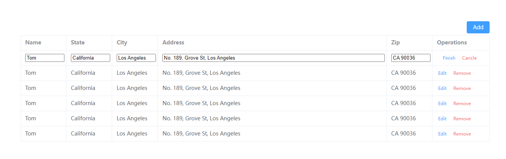

# editable-table-withelementplus

## Getting started

```bash
# clone the project
git clone https://github.com/StormerZSha/editable-table-withelementplus.git

# install dependency
npm install/pnpm install

# develop
npm run dev
```

### prevew
- 

